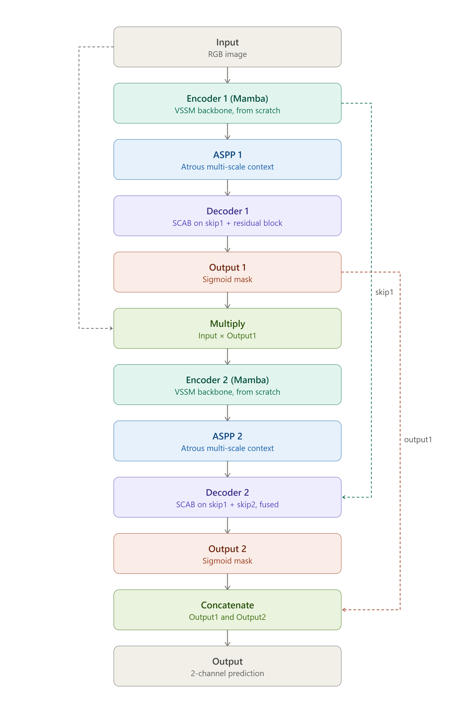

# DoubleMambaUNet

A cascaded, mask-gated dual-network segmentation architecture — the classic [DoubleU-Net](https://arxiv.org/abs/2006.04868) design, rebuilt with [VMamba](https://arxiv.org/abs/2401.10166) Visual State Space blocks instead of VGG-19 and plain convolutions.



Network 1 encodes the input, refines it through ASPP, and decodes it into an intermediate mask (Output 1). That mask multiplicatively gates the original image before it reaches Network 2, whose decoder fuses skip connections from **both** encoders at every stage — not just its own — through a Spatial-Channel Attention Bridge (SCAB) and a residual refinement block. The two masks are concatenated into a final 2-channel prediction.

## Why cascade two Mamba U-Nets

DoubleU-Net showed that a first network's coarse prediction can gate a second, refining network and meaningfully sharpen boundary precision — but that result was for CNNs. Mamba's linear-time selective scan gets its global context a completely different way than convolution does, so it wasn't obvious the same cascading trick would still help. It does: on our three benchmarks, the full model beats a single-network Mamba U-Net baseline by 1.31 Dice points on ISIC2017 alone, and an ablation study (in the paper) shows the cascade, SCAB + residual refinement, and dual-encoder skip fusion each contribute independently.

## Repo contents

| File | What it is |
|---|---|
| `vmamba.py` | VMamba backbone (`PatchEmbed2D`, `VSSLayer`, `VSSLayer_up`, `PatchExpand2D`, etc.) — the Mamba building blocks the model is assembled from |
| `double_mamba_unet.py` | The model itself: `DoubleMambaUNet`, its two encoders/decoders, `SCAttentionBridge`, `ResidualBlock`, `MambaASPP`, `DualSkipFusion` |
| `double_mamba_unet_training.ipynb` | End-to-end Kvasir-SEG training notebook — data loading, deep-supervision loss, training loop, and the full metric suite (Dice, mIoU, Accuracy, Sensitivity, Specificity, HD95) |

## Results

| Dataset | Modality | Dice |
|---|---|---|
| ISIC2017 | Dermoscopy (skin lesions) | 91.18% |
| Kvasir-SEG | Colonoscopy (polyps) | 93.36% |
| BUSI | Breast ultrasound (tumors) | 85.65% |

Full comparison tables against CNN, Transformer, and Mamba baselines, plus the ablation study, are in the paper.

## Setup

This needs `mamba_ssm`'s CUDA kernels, which means a Linux + CUDA environment — **it will not run on native Windows**. The training notebook is written for Google Colab and installs everything it needs:

```bash
pip install torch==2.3.1 torchvision==0.18.1 --index-url https://download.pytorch.org/whl/cu121
pip install causal-conv1d==1.4.0
pip install mamba-ssm==2.2.2
pip install timm einops albumentations torchmetrics medpy
```

`vmamba.py` and `double_mamba_unet.py` need to sit in the same directory (or both on `sys.path`) — `double_mamba_unet.py` imports directly with `from vmamba import (...)`.

## Quick usage

```python
import torch
from double_mamba_unet import DoubleMambaUNet

model = DoubleMambaUNet(in_chans=3, num_classes=1)
dummy = torch.randn(1, 3, 256, 256)
out = model(dummy)

print(out.shape)  # (1, 2, 256, 256) -- channel 0 = Output1, channel 1 = Output2 (final)
```

For training on your own dataset, open `double_mamba_unet_training.ipynb` — it's set up for Kvasir-SEG's `images/`/`masks/` folder layout, but the dataset class and augmentation pipeline are generic enough to point at any binary segmentation dataset with the same layout.

## Architecture notes

- **No pretrained backbone.** DoubleU-Net's first encoder uses ImageNet-pretrained VGG-19; there's no equivalent pretrained Mamba backbone, so both encoders here train from scratch.
- **ASPP is retained** at both bottlenecks from the original DoubleU-Net design, supplying fixed multi-scale context alongside Mamba's own adaptive, content-dependent aggregation.
- **SCAB** (Spatial-Channel Attention Bridge) refines every skip connection in two steps: a dilated-conv spatial gate, then a channel-recalibration bottleneck applied residually — same design as our earlier RMSNet work, reused here unmodified. *(TODO: link to the RMSNet repo/paper if public.)*
- **Decoder 2's dual-skip fusion** concatenates and projects skip features from both encoders before SCAB refinement, rather than just adding them — this is the one place the Mamba version diverges structurally from DoubleU-Net's own decoder fusion.

## Citation

If you use this in your own work, please cite:

```bibtex
@article{doublemambaunet2026,
  title   = {DoubleMambaUNet: A Cascaded Dual-Network Segmentation Architecture Built from Visual State Space Blocks},
  author  = {TODO: your name},
  year    = {2026},
  journal = {TODO}
}
```

Built on [VMamba](https://arxiv.org/abs/2401.10166) and the [DoubleU-Net](https://arxiv.org/abs/2006.04868) design pattern.

## License

TODO — add a LICENSE file (MIT and Apache-2.0 are the common choices for research code).
